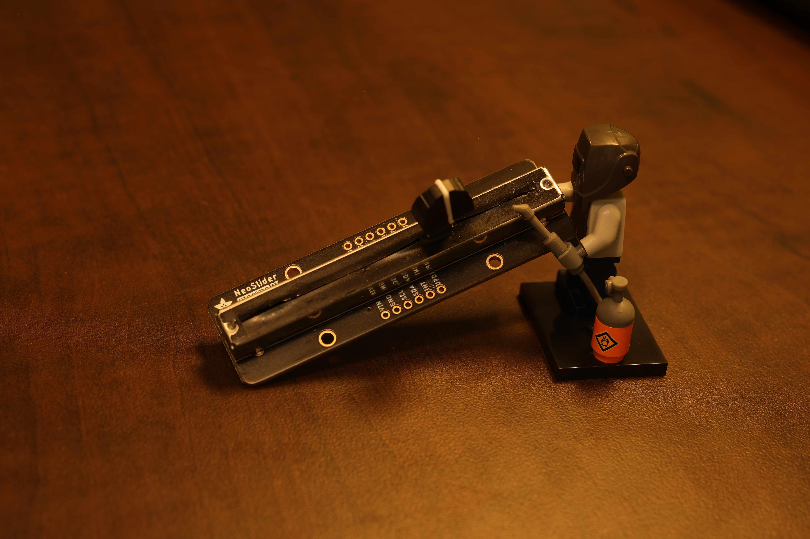
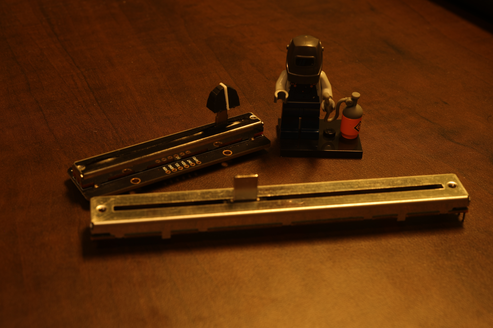
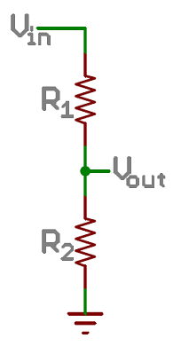
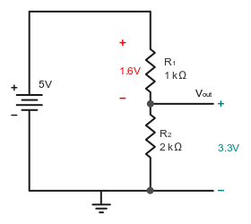
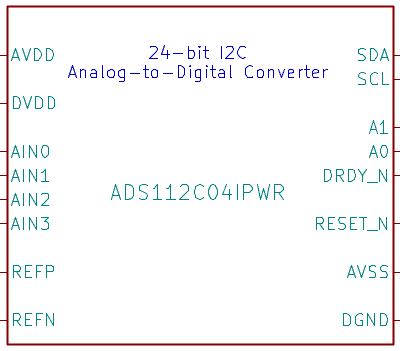
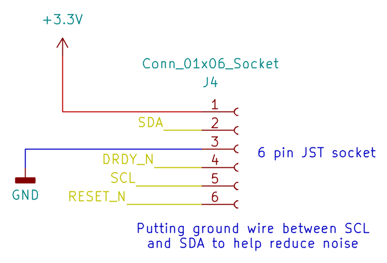
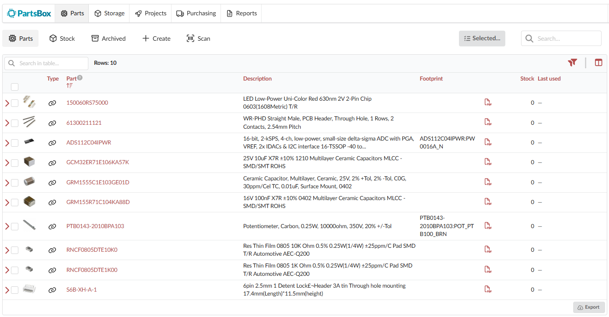

# pcb-100mm-slider-i2c

This [slider](https://www.adafruit.com/product/5295) from Adafruit is cool, but it has a problem. It is too small.



It has 65mm of travel distance for the slider movement.

Fortunately, it was easy to find a longer slider.



This is the PTB0143-2010BPA103, in Bourn's PTB Series. It is a Low Profile Slide Potentiometer.

It has a whopping 100mm of travel! Here are some other specs:

Resistance: 10 kOhms
Tolerance: 20%	
Taper: Linear
Life: 15,000 Cycles

15k cycles is pretty nice! I've already used 3 of them. 14,997 until it starts to wear out! Wahoo!

It's an awesome party, but we still have a problem. It's not attached to a PCB, so it doesn't have an I2C interface to actually start working with it.

I often see [PCBWay](https://www.pcbway.com/) sponsoring YouTubers that I like, so I figured that would be a great direction to go with them for this project too!


There's a lot to explain before we can send the design to PCBWay.

The first thing to cover is how a potentiometer works.

And to understand that, let's review a simple voltage divider.




The formula is:

```
Vout = Vin*R2/(R1+R2) 
```

So it lets you split voltages over resistors in series.

Here is an example with some voltage numbers.



A slide potentiometer is basically just a variable resistor. So it is a resistor that goes between 0 and 10k ohms as you slide it.


They even show circuit diagrams like these straight in the [Bourns slider datasheet.](https://www.bourns.com/docs/Product-Datasheets/PTB.pdf)


I drew this diagram to help compare.


In the above image, the two resistors would always add up to 10k in total. I just didn't have a good way to represent that in the drawing.

Now that we understand the voltage divider, the next step is to add a capacitor between the wiper and ground to filter out noise.


And I'm sure you're wondering now, what is the other 10k resistor doing in parallel with the circuit?

It's a long story and I'm not sure I even got it right.

First, it's nice to have a resistor in series with a slide pot, because when the wiper is all the way at one end, the resistance is 0 and it's connected to power, so there would be nothing limiting current in the case of a short due to a mistake in the circuit. It probably only needs to be 1k instead of 10k in that case.

It would have been a nice idea to add an optional jumper to bypass that resistor. But now that I think about it, I could pry it off the board and solder the pads together. Yeah, that would work fine if I want to experiment without it!

Second, which is also the main reason it's useful, is being able to use the slide pot as a rheostat instead of a voltage divider. To create a rheostat, you short the wiper to pin 3 of the slide pot. I didn't really find great explanations of this, and ended up getting confused and forgot to add a trace with a jumper to be able to try it in my circuit.

More importantly, I vibe coded this beautiful web demo to illustrate the difference (works better on desktop). Not 100% sure if the numbers it shows are right, but it's a good illustration of how the current flows.

----- DEMO HERE ------


Looking back, it would have been really great to make this easier to switch between these two configurations on the final circuit! A good lesson learned.

So now that we understand how the slide potentiometer works, what do we do with it?

The answer is simple. We connect AIN0 to an ADC (Analog to Digital converter).

There's tons to choose from, but I decided to use the ADS112C04 from Texas Instruments.

Link: https://www.ti.com/product/ADS112C04

The important part was these specs:

| Parameter | Value |
|---|---|
| Resolution (Bits) | 16 |
| Sample rate (max) (ksps) | 2 |
| Interface type | I2C |
|Digital supply (min) (V) | 2.3 |
|Digital supply (max) (V) |	5.5 |

This means we can have 2,000 readings per second, which is .5ms response time to the slider moving.

I2C is a super convenient interface for connecting to the chip.

3.3V power fits comfortably in the digital voltage range for the chip.

And finally, the resolution of 16 bit readings is completely overkill. Which is exactly what I wanted!

This basically means the max value from the ADC would be 65,535. 

Remember, the slider is 100mm long.

So in a perfect world, that means if you move the slider 0.00152590219 millimeters, that would equate to changing the digital value by 1.

The real world has a lot more noise obviously.

**I love the idea that moving the slider less than .01mm would be picked up by your computer in less than 1ms.**

Now we have our chip, we need to hook it up to the rest of the circuit:



The analog inputs are pretty easy to connect. AIN0 will go to the wiper of the slide pot, and the rest we just tie to ground. We aren't going to both with AIN2 and AIN3 in this design, and we will just measure the voltage between AIN0 and AIN1.


Next we have some data lines.


which will connect to the socket.



The datasheet said these should be connect to power with 1k pull-up resistors. And a capacitor was added between power and ground to help with filtering noise.


I also set up some jumpers to be able to configure the I2C address of the board.


So in the full schematic, I included these tips I found in my research.


> PCB Habits for 2-layer boards:
>
> - Use 6 mil wide signal trace, 20 mil wide power traces and 13 mil drilled diameter
> - Route components, signals and power paths on layer 1 and a ground plane on layer 2
> - Adjust components for less congested routing and space signal traces far apart
> - When you need to route a cross-under on the bottom layer, make it short. When you can't make it short, add a return strap over it
> - Place decoupling capacitors as close to the power pin of the IC and with as low a loop inductance as practical
> - Use the largest size capacitor in the smallest body with a voltage rating at least 2x the intended rail application. This is usually a 22 uF MLCC capacitor.
> - On all connectors, try to allocate one return for each digital signal, if possible

And here is everything all put together!


The next thing we need to do is pick out the actually parts we want to use to mark the board. That means picking out exactly which capacitor, which resistor, etc.

I found that [partsbox](https://partsbox.com/) is free and is pretty useful to document the list of parts.



Pretty much when I was looking for parts, I would dig through Digikey and Mouser to filter and see what parts are popular for the category.

But I also really wanted to use some super tiny capacitors on the PCB.
They are better for causing less interference in the circuit, and letting you have shorter distance between components. Also, TI specifically recommended ceramic capacitors to use with the ADC.

I found GRM1555C1E103GE01D from Murata, which is a  0.01uF, surface mount, Multilayer Ceramic Capactior. Specifically, it uses the 0402 footprint, which is about 1mm square.


It's actually amazing that [PCBWay](https://www.pcbway.com/) will solder these tiny capacitors perfectly for you. So I can use them freely on my board, and I don't have to deal with soldering them by hand.

The next part is laying out the PCB with KICAD. I can't remember if I used an AI summary or found a blog post or what for these layout guidelines, or I might have just pieces bullet points together from different sources. But it definitely help me along the way!

> **Layout Guidelines**
>
> Employing best design practices is recommended when laying out a printed-circuit board (PCB) for both analog and digital components. This recommendation generally means that the layout separates analog components [such as ADCs, amplifiers, references, digital-to-analog converters (DACs), and analog MUXs] from digital components [such as microcontrollers, complex programmable logic devices (CPLDs), field-programmable gate arrays (FPGAs), radio frequency (RF) transceivers, universal serial bus (USB) transceivers, and switching regulators]. Figure 82 shows an example of good component placement. Although Figure 82 provides a good example of component placement, the best placement for each application is unique to the geometries, components, and PCB fabrication capabilities employed. That is, there is no single layout that is perfect for every design and careful consideration must always be used when designing with any analog component.
>
> The following basic recommendations for layout of the ADS112C04 help achieve the best possible performance of the ADC. A good design can be ruined with a bad circuit layout.
>
> Separate analog and digital signals. To start, partition the board into analog and digital sections where the layout permits. Routing digital lines away from analog lines prevents digital noise from coupling back into analog signals.
>
> The ground plane can be split into an analog plane (AGND) and digital plane (DGND), but is not necessary. Place digital signals over the digital plane, and analog signals over the analog plane. As a final step in the layout, the split between the analog and digital grounds must be connected to together at the ADC.
>
> Fill void areas on signal layers with ground fill.
>
> Provide good ground return paths. Signal return currents flow on the path of least impedance. If the ground plane is cut or has other traces that block the current from flowing right next to the signal trace, another path must be found to return to the source and complete the circuit. If forced into a larger path, the chance that the signal radiates increases. Sensitive signals are more susceptible to EMI interference.
>
> Use bypass capacitors on supplies to reduce high-frequency noise. Do not place vias between bypass capacitors and the active device. Placing the bypass capacitors on the same layer as close to the active device yields the best results.
>
> Consider the resistance and inductance of the routing. Often, traces for the inputs have resistances that react with the input bias current and cause an added error voltage. Reducing the loop area enclosed by the source signal and the return current reduces the inductance in the path. Reducing the inductance reduces the EMI pickup and reduces the high-frequency impedance at the input of the device.
>
> Watch for parasitic thermocouples in the layout. Dissimilar metals going from each analog input to the sensor can create a parasitic thermocouple that can add an offset to the measurement. Differential inputs must be matched for both the inputs going to the measurement source.
>
> Analog inputs with differential connections must have a capacitor placed differentially across the inputs. Best input combinations for differential measurements use adjacent analog input lines (such as AIN0, AIN1 and AIN2, AIN3). The differential capacitors must be of high quality. The best ceramic chip capacitors are C0G (NPO) that have stable properties and low noise characteristics.

and more guidelines specific to our chip:

> **ADS112C04 layout recommendations**
>
> - Separate analog and digital signals. Partition the board into analog and digital sections where the layout permits.
> - The ground plane can be split into AGND and DGND, but is not necessary. Connect the split together at the ADC as a final step.
> - Fill void areas on signal layers with ground fill.
> - Provide good ground return paths. Return current forced into a larger loop increases radiation and EMI susceptibility.
> - Use bypass capacitors on supplies. No vias between the bypass capacitor and the active device, same layer, as close as possible.
> - Consider trace resistance and inductance. Input trace resistance reacts with input bias current and adds an error voltage.
> - Watch for parasitic thermocouples. Match the dissimilar-metal transitions on both differential inputs.
> - Place a differential capacitor across differential inputs. Use adjacent input pairs (AIN0/AIN1, AIN2/AIN3) and C0G (NPO) dielectric.

-----

Anyway, in Kicad, you want to set up each part in the schematic with the symbol properties. It looks like this:


This is super important because it will know what footprints to use with which parts of the schematic. And it will let the PCBWay Kicad plugin export the BOM automatically. But more on that later!


